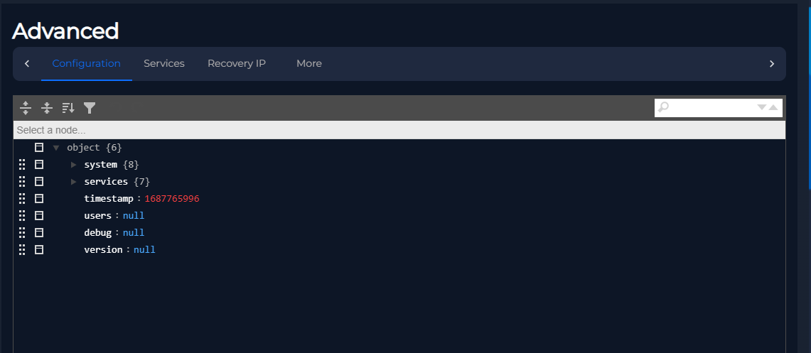
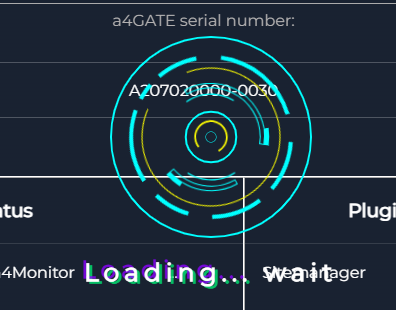
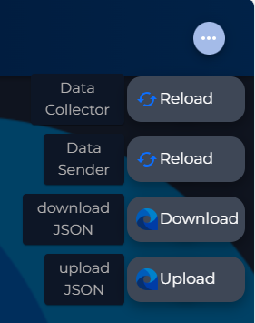
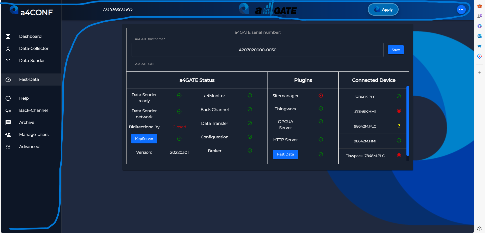

# Components doc
These components are used inside some parts of the applications and are not route-specific but they can be use for different pourpose.
## List of components

- [Components doc](#components-doc)
  - [List of components](#list-of-components)
  - [Back Button](#back-button)
    - [Props](#props)
    - [Usage](#usage)
    - [Example](#example)
    - [Functionality](#functionality)
  - [Errors](#errors)
    - [Error boundary compnent](#error-boundary-compnent)
  - [Props](#props-1)
  - [Usage](#usage-1)
    - [ErrorFallback Component](#errorfallback-component)
    - [Props](#props-2)
    - [Functionality](#functionality-1)
    - [Example](#example-1)
  - [JsonEditor](#jsoneditor)
  - [Loader](#loader)
  - [MainButtons](#mainbuttons)
    - [StyledButton Component](#styledbutton-component)
      - [Usage](#usage-2)
      - [Props](#props-3)
      - [Example](#example-2)
    - [ReloadInternal Component](#reloadinternal-component)
      - [Function: `handleInternalReload`](#function-handleinternalreload)
    - [ReloadExternal Component](#reloadexternal-component)
      - [Function: `handleExternalReload`](#function-handleexternalreload)
    - [DownloadConfig Component](#downloadconfig-component)
      - [Function: `handleDownloadConfig`](#function-handledownloadconfig)
    - [UploadConfig Component](#uploadconfig-component)
      - [Function: `handleFileUpload`](#function-handlefileupload)
    - [AdminEl Component](#adminel-component)
      - [Logic:](#logic)
      - [Function: `handleClick `](#function-handleclick-)
  - [Menu](#menu)
    - [Usage](#usage-3)
    - [Logic:](#logic-1)
    - [Functions Called:](#functions-called)
  - [Multipletagstoarray](#multipletagstoarray)
    - [Subcomponents](#subcomponents)
      - [TagSelectionDialog](#tagselectiondialog)
        - [Usage](#usage-4)
        - [Properties:](#properties)
        - [Functions Called:](#functions-called-1)
        - [Custom Components Used:](#custom-components-used)
        - [Logic:](#logic-2)
      - [MultipleTagsToArrayComponent](#multipletagstoarraycomponent)
        - [Usage](#usage-5)
        - [Properties:](#properties-1)
        - [Functions Called:](#functions-called-2)
        - [Logic:](#logic-3)
      - [AddCAToloTGateway](#addcatolotgateway)
        - [Properties:](#properties-2)
        - [Functions Called:](#functions-called-3)
        - [Logic:](#logic-4)
      - [TreeView](#treeview)
        - [Properties:](#properties-3)
        - [Functions Called:](#functions-called-4)
        - [Logic:](#logic-5)
      - [IoTGatewayList](#iotgatewaylist)
        - [Properties:](#properties-4)
        - [Functions Called:](#functions-called-5)
        - [Logic:](#logic-6)
  - [PrivateRoute](#privateroute)
    - [Properties:](#properties-5)
    - [Contexts Used:](#contexts-used)
    - [Hooks Used:](#hooks-used)
    - [Logic:](#logic-7)
  - [SaveButton](#savebutton)
    - [Functionality:](#functionality-2)
    - [Props:](#props-4)
    - [Structure:](#structure)
    - [Styling:](#styling)
  - [SecondaryNavbar](#secondarynavbar)
    - [Props:](#props-5)
    - [Functionality:](#functionality-3)
    - [Dependencies:](#dependencies)
    - [Structure:](#structure-1)
    - [Styling:](#styling-1)
  - [Table](#table)
    - [Table component](#table-component)
      - [Props:](#props-6)
      - [Functionality:](#functionality-4)
      - [Dependencies:](#dependencies-1)
    - [CreateNewAccountModal component](#createnewaccountmodal-component)
      - [Props:](#props-7)
      - [Functionality:](#functionality-5)
      - [Dependencies:](#dependencies-2)

## Back Button
The `BackButton` component is a reusable component used for navigating back in the browser history. It consists of a button with an arrow icon and a page title.

### Props

- `pageTitle`: Specifies the title of the page.
### Usage

```javascript
import { Stack, Button } from "@mui/material"
import { ArrowBackIos } from "@mui/icons-material"
import { useLocation, useNavigate } from "react-router-dom";

export default function BackButton(props) {
    const { pageTitle } = props
    const location = useLocation();
    const currentURLArray = location.pathname.split("/");

    const navigate = useNavigate();

    const handleClick = () => {
        currentURLArray.pop()
        navigate(`/${currentURLArray.toString().replace(',', '')}`);
    }

    return (
        <div style={{margin: '10px 0px'}}>
            <Stack direction="row" spacing={4} alignItems="center" justifyContent="flex-start">
                <Button variant="outlined" color="secondary" startIcon={<ArrowBackIos />} onClick={handleClick}>
                    Back
                </Button>
                <h2 style={{fontWeight: 800, fontSize: 30 }}>{pageTitle}</h2>
            </Stack>
        </div>
    )
}
```
### Example
```javascript
<BackButton pageTitle="Page Title" />

```

### Functionality
The component extracts the current URL path using the useLocation hook from React Router.
It provides a button with an arrow icon that, when clicked, navigates back in the browser history by popping the last item from the URL array.
The page title is displayed alongside the back button.


## Errors
Everythings needs to be wraspped inside an ErrorCacher component in order to prevent the crash of the whole app in case of an error
### Error boundary compnent
The `ErrorBoundary` component is a higher-order component used to catch errors in any components below it and re-render with an error message using the `ErrorFallback` component.

## Props

- None

## Usage

```javascript
import React from "react";
import ErrorBoundary from "./ErrorBoundary";

class App extends React.Component {
  render() {
    return (
      <ErrorBoundary>
        {/* Your components */}
      </ErrorBoundary>
    );
  }
}

export default App;
```
### ErrorFallback Component
The ErrorFallback component is used to display error information and provide steps for the user to take when an error occurs.

### Props
- error: The error message.
- errorInfo: The stack trace of the error.

### Functionality
Displays an error message and provides steps for the user to follow to resolve the issue.
Provides a button to download a report in JSON format.
Allows the user to navigate through the steps using a stepper.


### Example
```javascript
return (
      <ErrorCacher>
        <Container sx={{ flexGrow: 1 }} disableGutters>
          {/*other stuff*/}
        </Container>
      </ErrorCacher>
    );

```

## JsonEditor
This component is used to render JSON elements in an interactive way


## Loader

The loader is just a visual component with its .css to spin.



## MainButtons
This component is actually made of 5 different components.



### StyledButton Component

The `StyledButton` component provides a styled button with customizable styles.

#### Usage

```javascript
import styled from "styled-components";

export const StyledButton = styled("div")`
  // CSS styles for the button;
```
#### Props
The StyledButton component does not accept any props directly. However, you can pass props to customize its behavior and appearance using styled-components.

#### Example
```jsx
<StyledButton>
  {/* Button content */}
</StyledButton>

```
### ReloadInternal Component
The ReloadInternal component is responsible for handling internal reload actions.

#### Function: `handleInternalReload`
Description:
This function handles the internal reload action. It dispatches an update action to Redux store with the new configuration data fetched from the server.

### ReloadExternal Component
The ReloadExternal component is responsible for handling external reload actions.

#### Function: `handleExternalReload`

Description:
This function handles the external reload action. It dispatches an update action to Redux store with the new configuration data fetched from the external source.

### DownloadConfig Component
The DownloadConfig component allows users to download configuration files.
#### Function: `handleDownloadConfig`
Description:
This function handles the download configuration action. It triggers the download of the JSON configuration file.

### UploadConfig Component
The UploadConfig component allows users to upload configuration files.

#### Function: `handleFileUpload`
Description:
This function handles the file upload action. It parses the uploaded JSON file, performs necessary operations based on the file content, and dispatches an update action to Redux store with the new configuration data.

Parameters:
event: The file upload event containing the uploaded file.


### AdminEl Component
The AdminEl component provides an admin button for elevation.
This component represents an administrative button. When clicked, it navigates the user to the admin login page.
#### Logic:
Renders a styled button with an admin panel icon and the text "Admin".
When clicked, it navigates the user to the admin login page.
#### Function: `handleClick `
Navigates the user to the admin login page.
This component is typically used in scenarios where administrative actions need to be accessed, such as elevating user privileges or accessing administrative settings.


## Menu

Description:
This component represents a mini drawer layout with an app bar and a side drawer. It provides navigation functionality and displays the main content area.

### Usage
```javascript
<MiniDrawer>
  {/* Main content goes here */}
</MiniDrawer>
```

### Logic:
Manages the opening and closing of the side drawer based on user interaction.
Dynamically adjusts the width of the app bar and side drawer based on their open/close state.
Displays the main content area and provides navigation functionality to different sections of the application.

### Functions Called:
* `handleDrawerOpen`: Toggles the opening of the side drawer.
* `handleDrawerClose`: Toggles the closing of the side drawer.
* `handleSendConf`: Handles the logic for sending the configuration to a4GATE.
* `applyChanges`: Applies changes to the configuration.
* `applyOnlyPCA`: Applies changes to the configuration only on Data Collector.
* `navigate`: Navigates to different sections of the application based on user interaction.
This component is typically used as the layout for the main section of the application, providing navigation and content organization.




## Multipletagstoarray

### Subcomponents

- [TagSelectionDialog](#tagselectiondialog)


#### TagSelectionDialog

This component represents a dialog window with a maximum width and dynamic content inside. It allows users to choose tags and create a complex array based on their selections.

##### Usage
```javascript
<MaxWidthDialog 
  open={/* boolean indicating whether the dialog is open or not */}
  setOpen={/* function to control the open/close state of the dialog */}
  channel={/* string representing the channel */}
  device={/* string representing the device */}
  tags={/* object containing tags data */}
  setMemoryBasedList={/* function to set the memory based list */}
/>
```

##### Properties:
* `open`: Boolean indicating whether the dialog is open or not.
* `setOpen`: Function to control the open/close state of the dialog.
* `channel`: String representing the channel.
* `device`: String representing the device.
* `tags`: Object containing tags data.
* `setMemoryBasedList`: Function to set the memory based list.
##### Functions Called:
* `handleRequestFeedback`: Handles request feedback by showing a snack bar with a message.
* `handleClose`: Closes the dialog.
* `transformIotGatewayCart`: Transforms the IoT gateway cart data into a flat array of tags.
* `findMatches`: Finds matches between the selected tags and the total tag list.
* `handleCreate`: Handles the creation of a complex array based on the selected tags.
##### Custom Components Used:
`TransferComponent`: A component for transferring tags between lists.
##### Logic:
Opens and closes the dialog based on user interaction.
Transforms the hierarchical IoT gateway cart data into a flat array of tags for easier manipulation.
Finds matches between the selected tags and the total tag list.
Handles the creation of a complex array based on the selected tags.
Provides UI for selecting tags and creating a complex array.
This component is typically used within the application for managing tags and creating complex arrays.

#### MultipleTagsToArrayComponent
This component allows users to create a complex array by selecting multiple tags from Kepware channels and devices. It guides users through a step-by-step process to choose the necessary parameters and initiate the creation of the complex array
##### Usage

```javascript
<MultipleTagsToArrayComponent 
  channelList={/* object containing Kepware channel data */}
  setChannelList={/* function to set the Kepware channel list */}
  setMemoryBasedList={/* function to set the memory based list */}
/>
```

##### Properties:
* `channelList`: Object containing Kepware channel data.
* `setChannelList`: Function to set the Kepware channel list.
* `setMemoryBasedList`: Function to set the memory based list.
##### Functions Called:
* `handleRequestFeedback`: Handles request feedback by showing a snack bar with a message.
* `handleRefreshKepwareChannels`: Loads Kepware channels and displays feedback messages accordingly.
* `handleStartBrowsing`: Initiates the browsing of tags for the selected channel and device.
* `handleNext`: Handles the transition to the next step in the stepper.
* `handleBack`: Handles the transition to the previous step in the stepper.
* `handleReset`: Resets the stepper to the initial state.
##### Logic:
Displays a stepper to guide users through the process of creating a complex array.
Allows users to refresh Kepware channels and devices.
Enables users to select a channel and a device from dropdown menus.
Allows users to start browsing tags for the selected channel and device.
Displays feedback messages based on the outcome of loading Kepware channels, selecting devices, and browsing tags.
Provides options to navigate between steps, reset the process, and complete the creation of the complex array.
This component facilitates the creation of complex arrays by simplifying the selection process and providing clear feedback to the user.

#### AddCAToloTGateway
This component enables users to add complex array tags to existing IoT Gateways in order to transfer them to the Data Sender. It guides users through a step-by-step process to select the device, choose tags, select the IoT Gateway, and add the tags.

```javascript
<AddCAToIoTGateway 
  memoryBasedList={/* object containing memory based list */}
  setMemoryBasedList={/* function to set the memory based list */}
/>
```

##### Properties:
* `memoryBasedList`: Object containing memory based list.
* `setMemoryBasedList`: Function to set the memory based list.
##### Functions Called:
* `handleRequestFeedback`: Handles request feedback by showing a snack bar with a message.
* `handleReloadMemoryBasedDevice`: Loads memory-based Kepware devices and displays feedback messages accordingly.
* `handleReloadIoTGateways`: Loads IoT Gateways from Kepware and displays feedback messages accordingly.
* `handleToggleAll`: Toggles all checkboxes in a list.
* `handleCheckedRight`: Moves selected tags from the left list to the right list.
* `handleCheckedLeft`: Moves selected tags from the right list to the left list.
* `handleAddTags`: Adds selected complex array tags to the selected IoT Gateway.
* `handleNext`: Handles the transition to the next step in the stepper.
* `handleBack`: Handles the transition to the previous step in the stepper.
* `handleReset`: Resets the stepper to the initial state.
not: Returns the items in list a that are not in list b.
* `intersection`: Returns the items that are common in both lists a and b.
* `union`: Returns the union of lists a and b.
##### Logic:
Displays a stepper to guide users through the process of adding complex array tags to IoT Gateways.
Allows users to refresh memory-based Kepware devices and select a device from the dropdown menu.
Enables users to choose which tags to import from the selected device.
Allows users to select an IoT Gateway from the dropdown menu to add the selected tags.
Provides options to navigate between steps, add tags, and complete the process.
This component streamlines the process of adding complex array tags to IoT Gateways by providing clear instructions and feedback to the user.

#### TreeView
This component displays a hierarchical tree view with icons representing each node. It allows users to select multiple items using checkboxes associated with each node. The tree structure is created based on the provided data.
```javascript

```
##### Properties:
* `tags`: Object containing hierarchical data to be displayed in the tree view.
* `channelCart`: Array of selected channel paths.
* `setChannelCart`: Function to set the selected channel cart.
##### Functions Called:
* `createStyledTreeItems`: Creates styled tree items based on the provided hierarchical data.
* `StyledTreeItem`: Renders styled tree items with checkboxes and appropriate icons.
##### Logic:
Utilizes the TreeView component from Material-UI to display the hierarchical tree view.
Uses the createStyledTreeItems function to generate styled tree items recursively based on the hierarchical data.
Each tree item includes a checkbox, an icon, and text representing the node.
Allows users to select multiple items by checking the checkboxes associated with each node.
Provides styling customization options based on the selected theme mode (light or dark).
This component provides a visually appealing and interactive way to navigate and select items from hierarchical data using a tree view structure.


#### IoTGatewayList
This component renders a tree view with icons for each node, allowing users to delete nodes from the tree. It builds the tree structure based on the provided array of data.

```javascript
<IconTreeView 
  iotGatewayCart={/* array of nodes representing IoT gateways */}
  setIotGatewayCart={/* function to set the IoT gateway cart */}
/>
```
##### Properties:
* `iotGatewayCart`: Array of nodes representing IoT gateways.
* `setIotGatewayCart`: Function to set the IoT gateway cart.
##### Functions Called:
* `buildTree`: Builds the tree structure based on the provided array of nodes.
* `StyledTreeItem`: Renders styled tree items with icons and delete button.
##### Logic:
Utilizes the TreeView component from Material-UI to display the tree view.
Uses the buildTree function to generate tree components recursively based on the provided array of nodes.
Each tree item includes an icon, text representing the node, and a delete button.
Provides functionality to delete nodes from the tree by clicking the delete button associated with each node.
This component offers a convenient way to visualize and manage IoT gateway nodes in a hierarchical tree structure, allowing users to delete nodes as needed.
## PrivateRoute
This component is used to render routes conditionally based on authentication and user permissions. It allows rendering children components only if certain conditions are met, otherwise, it redirects the user to the login page.

```javascript
<PrivateRoute 
  authenticated={/* boolean indicating whether the user is authenticated */}
  superUserRequired={/* boolean indicating whether superuser privileges are required */}
>
  {/* Children components to render */}
</PrivateRoute>

```

### Properties:
* `authenticated`: A boolean indicating whether the user is authenticated.
* `superUserRequired`: A boolean indicating whether superuser privileges are required.
* `children`: The children components to render within the route.
### Contexts Used:
SuperUserContext: Context used to determine if the user is a superuser.
### Hooks Used:
useNavigate: Hook from React Router used to navigate to different routes.
### Logic:
Retrieves the superuser context using the useContext hook.
Conditionally renders the children components based on the provided authentication and superuser requirements:
If superUserRequired is true and the user is authenticated and is a superuser, renders the children components.
If superUserRequired is true but the user is not a superuser, redirects the user to the login page with an option to replace the current URL.
If superUserRequired is false or not specified, and the user is authenticated, renders the children components.
If the user is not authenticated, redirects the user to the login page.
This component simplifies the process of protecting routes in a React application by handling authentication and user permissions. It ensures that only authorized users can access certain routes, making it suitable for building secure web applications.

## SaveButton
This component renders a save button typically used in forms or data entry interfaces. It provides a button labeled "Save" for users to trigger saving actions.
### Functionality:
Displays a button labeled "Save".
The button triggers saving actions when clicked.
Dependencies:
Grid: Component from Material-UI used to layout the button.
StyledButton: Custom styled button component.
### Props:
This component does not accept any props.

### Structure:
Uses Material-UI's Grid component to organize the layout.
Contains a single button labeled "Save" within a grid container.
CSS Classes:
transition: CSS class used for button transitions.
label: CSS class used for styling the button label.
### Styling:
Adds a custom style to adjust the margin of the button to position it properly.
```javascript
<SaveButton />
```
## SecondaryNavbar
This component represents a secondary navigation bar typically used to switch between different sections or views within a page. It consists of tabs that allow users to select the desired section.
```javascript
<SecondaryNavbar
  currentTab={currentTab}
  setCurrentTab={setCurrentTab}
  navbarItems={navbarItems}
/>
```
### Props:
* `currentTab`: The currently selected tab value.
* `setCurrentTab`: Function to handle tab change. It updates the current tab value.
* `navbarItems`: An array of strings representing the labels for each tab.
### Functionality:
Displays a secondary navigation bar with tabs.
Allows users to switch between different sections or views by clicking on the tabs.
### Dependencies:
Tabs: Component from Material-UI used to render the tabs.
Tab: Component from Material-UI used to represent each individual tab.
### Structure:
Utilizes Material-UI's Tabs component to organize the tabs.
Each tab is represented by the Tab component.
### Styling:
Sets the variant of the tabs to "scrollable" to allow scrolling when there are many tabs.
Applies custom styles for the background color and border radius to enhance visual appeal.

## Table
This component is used to display tabular data with functionalities like adding, editing, and deleting rows. It supports features such as column ordering, row editing through a modal, and row actions for editing and deleting.

### Table component
```javascript
<Table
  tableData={tableData}
  setTableData={setTableData}
  columnsData={columnsData}
  selectableObjectData={selectableObjectData}
  validationObject={validationObject}
  staticValue={staticValue}
/>
```
#### Props:
* `tableData`: Array of objects representing the data to be displayed in the table.
* `setTableData`: Function to update the table data.
* `columnsData`: Array of column configuration objects defining the table structure.
* `selectableObjectData`: Object containing selectable object data for certain columns.
* `validationObject`: Object containing validation fields and validation agents for input validation.
* `staticValue`: Default value for non-editable columns.
#### Functionality:
Displays tabular data with customizable columns.
Supports row editing through a modal with validation.
Allows adding new rows with validation checks.
Enables deleting rows from the table.
Provides row actions for editing and deleting.
#### Dependencies:
MaterialReactTable: Component from "material-react-table" library for rendering the table.
Box, Button, IconButton, Tooltip: Components from Material-UI for UI elements.
CreateNewAccountModal: Custom modal component for creating new rows.

### CreateNewAccountModal component
This component represents a modal dialog used for creating new rows in the table. It includes form fields based on the column configuration provided.

This component is used internally by the Table component and is not intended for standalone usage.

#### Props:
* `open`: Boolean indicating whether the modal is open.
* `columns`: Array of column configuration objects defining the form fields.
* `onClose`: Function to handle modal close event.
* `onSubmit`: Function to handle form submission.
* `selectableObjectData`: Object containing selectable object data for certain columns.
* `validationFields`: Array of fields to validate.
* `validationAgents`: Array of validation functions corresponding to validation fields.
* `staticValue`: Default value for non-editable columns.
#### Functionality:
Displays a modal dialog for creating new rows.
Dynamically generates form fields based on the column configuration.
Validates input fields based on specified validation rules.
Submits the form data upon validation.
#### Dependencies:
Dialog, DialogTitle, DialogContent, DialogActions, Divider, TextField, Autocomplete: Components from Material-UI for building the modal.
Button, IconButton: Components from Material-UI for buttons and icons.
SnackbarContext: Context for displaying snackbars.

```javascript
<CreateNewAccountModal
  columns={columns}
  open={open}
  onClose={handleClose}
  onSubmit={handleSubmit}
  selectableObjectData={selectableObjectData}
  validationFields={validationFields}
  validationAgents={validationAgents}
  staticValue={staticValue}
/>
```
This component provides a convenient way to create new rows with customizable form fields and validation in a modal dialog.
